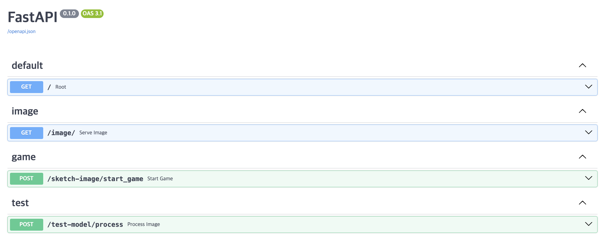
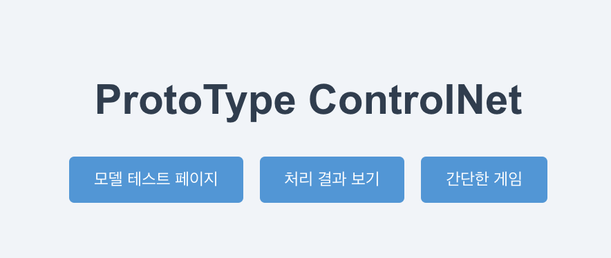
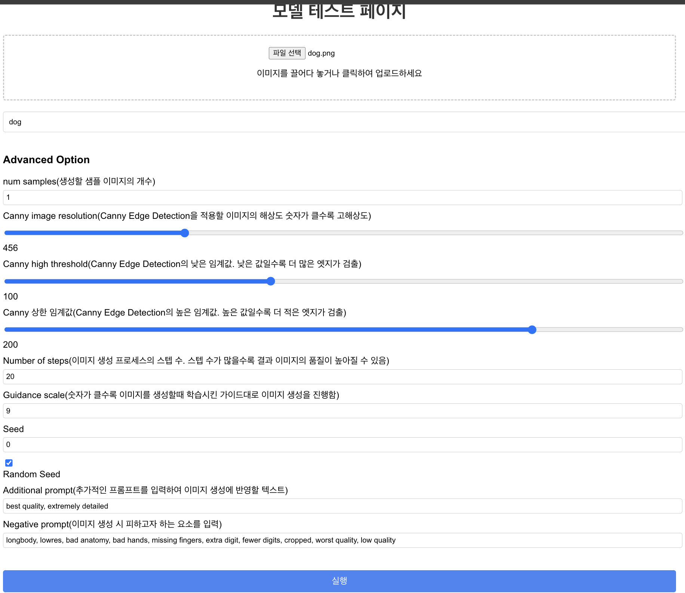
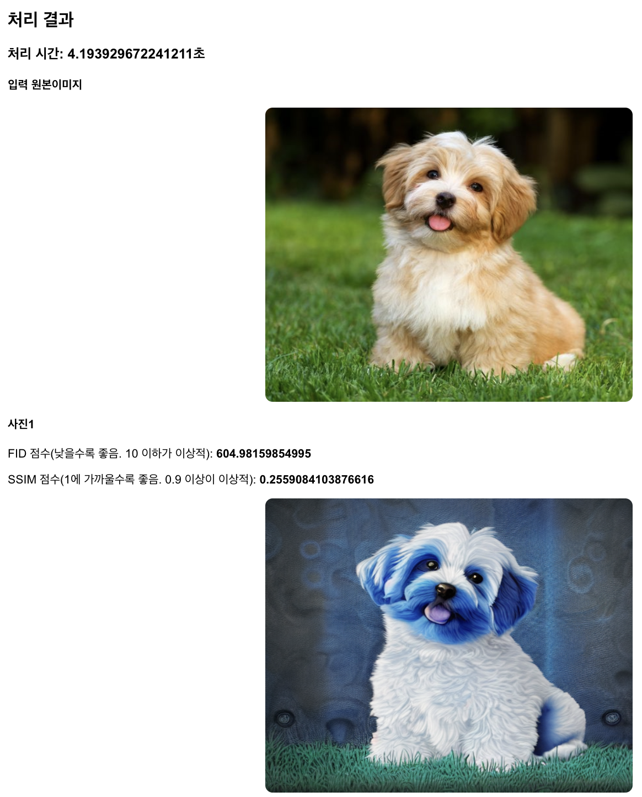
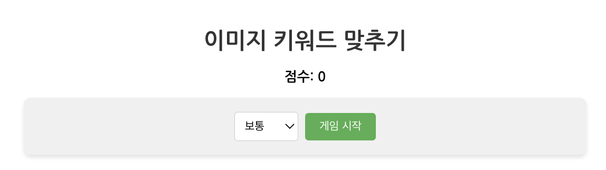
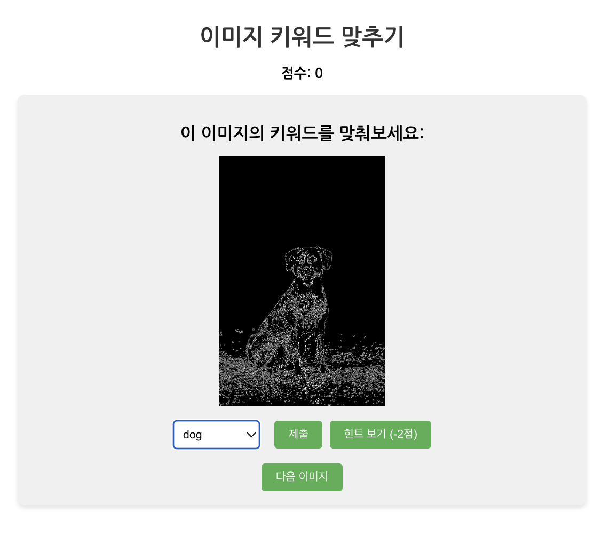

# ControlNet 실행을 위한 세팅

vast ai의 서버를 임대하여 base 이미지를 **nvidia/cuda:11.1.1-devel-ubuntu20.04**로 선택함

## ubuntu package 업그레이드 및 설치

```sh
apt update
apt-get update && apt-get install -y libglib2.0-0 libsm6 libxext6 libxrender1
ln -s /usr/bin/python3 /usr/bin/python
```

## 가상환경 & 의존성 관리 준비

```sh
pip3 install --upgrade pip
pip3 install poetry
```

## code 준비

```sh
git clone https://github.com/hyeonDD/control-net.git
cd control-net/backend/

# Detector(모두) 다운받는 코드
cd control_net_model

cd ./annotator/ckpts
curl -LO https://huggingface.co/lllyasviel/ControlNet/resolve/main/annotator/ckpts/body_pose_model.pth
curl -LO https://huggingface.co/lllyasviel/ControlNet/resolve/main/annotator/ckpts/dpt_hybrid-midas-501f0c75.pt
curl -LO https://huggingface.co/lllyasviel/ControlNet/resolve/main/annotator/ckpts/hand_pose_model.pth
curl -LO https://huggingface.co/lllyasviel/ControlNet/resolve/main/annotator/ckpts/mlsd_large_512_fp32.pth
curl -LO https://huggingface.co/lllyasviel/ControlNet/resolve/main/annotator/ckpts/mlsd_tiny_512_fp32.pth
curl -LO https://huggingface.co/lllyasviel/ControlNet/resolve/main/annotator/ckpts/network-bsds500.pth
curl -LO https://huggingface.co/lllyasviel/ControlNet/resolve/main/annotator/ckpts/upernet_global_small.pth

# Models(모두) 다운받는 코드
cd ../../models
curl -LO https://huggingface.co/lllyasviel/ControlNet/resolve/main/models/control_sd15_canny.pth
curl -LO https://huggingface.co/lllyasviel/ControlNet/resolve/main/models/control_sd15_depth.pth
curl -LO https://huggingface.co/lllyasviel/ControlNet/resolve/main/models/control_sd15_hed.pth
curl -LO https://huggingface.co/lllyasviel/ControlNet/resolve/main/models/control_sd15_mlsd.pth
curl -LO https://huggingface.co/lllyasviel/ControlNet/resolve/main/models/control_sd15_normal.pth
curl -LO https://huggingface.co/lllyasviel/ControlNet/resolve/main/models/control_sd15_openpose.pth
curl -LO https://huggingface.co/lllyasviel/ControlNet/resolve/main/models/control_sd15_scribble.pth
curl -LO https://huggingface.co/lllyasviel/ControlNet/resolve/main/models/control_sd15_seg.pth
```

## 가상환경 설치 및 fastapi 실행

**실행전 backend 경로 밑의 .env_sample파일을 참고하여 필요한것을 설정해두어야 합니다.**

```sh
poetry install
poetry shell
python fastapi_main.py
```

## frontend 실행

```sh
# node 18 버전 설치
curl -fsSL https://deb.nodesource.com/setup_18.x | sudo -E bash -
apt-get install nodejs
# yarn 설치
npm install -g yarn
# 필요 패키지 설치
apt-get install -y libgl1-mesa-glx
```

```sh
# frontend 실행
cd ~/control-net/frontend/control_net/
yarn install
yarn start
```

# backend 실행사진(swagger)



# frontend 실행사진

main 페이지



model test 페이지





간단한 스케치 맞추기 게임




