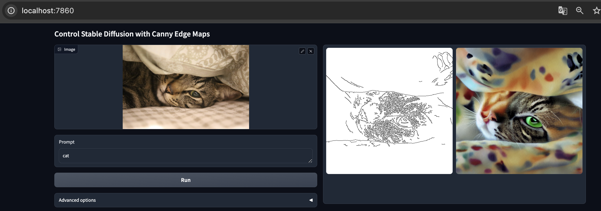

# ubuntu 환경 준비

vast ai의 서버를 임대하여 base 이미지를 **nvidia/cuda:11.1.1-devel-ubuntu20.04**로 선택함

```sh
# ubuntu package 업그레이드 및 설치
apt update
apt-get update && apt-get install -y libglib2.0-0 libsm6 libxext6 libxrender1
ln -s /usr/bin/python3 /usr/bin/python
```

# 가상환경 & 의존성 관리 준비

```sh
pip3 install --upgrade pip
pip3 install poetry
```

# ControlNet V1.0 준비

```sh
mkdir control_net_v1.0
cd control_net_v1.0
git clone https://github.com/lllyasviel/ControlNet.git
mv ControlNet control_net_model

# Detector(모두) 다운받는 코드
cd control_net_model

cd ./annotator/ckpts
curl -LO https://huggingface.co/lllyasviel/ControlNet/resolve/main/annotator/ckpts/body_pose_model.pth
curl -LO https://huggingface.co/lllyasviel/ControlNet/resolve/main/annotator/ckpts/dpt_hybrid-midas-501f0c75.pt
curl -LO https://huggingface.co/lllyasviel/ControlNet/resolve/main/annotator/ckpts/hand_pose_model.pth
curl -LO https://huggingface.co/lllyasviel/ControlNet/resolve/main/annotator/ckpts/mlsd_large_512_fp32.pth
curl -LO https://huggingface.co/lllyasviel/ControlNet/resolve/main/annotator/ckpts/mlsd_tiny_512_fp32.pth
curl -LO https://huggingface.co/lllyasviel/ControlNet/resolve/main/annotator/ckpts/network-bsds500.pth
curl -LO https://huggingface.co/lllyasviel/ControlNet/resolve/main/annotator/ckpts/upernet_global_small.pth

# Models(모두) 다운받는 코드
cd ../../models
curl -LO https://huggingface.co/lllyasviel/ControlNet/resolve/main/models/control_sd15_canny.pth
curl -LO https://huggingface.co/lllyasviel/ControlNet/resolve/main/models/control_sd15_depth.pth
curl -LO https://huggingface.co/lllyasviel/ControlNet/resolve/main/models/control_sd15_hed.pth
curl -LO https://huggingface.co/lllyasviel/ControlNet/resolve/main/models/control_sd15_mlsd.pth
curl -LO https://huggingface.co/lllyasviel/ControlNet/resolve/main/models/control_sd15_normal.pth
curl -LO https://huggingface.co/lllyasviel/ControlNet/resolve/main/models/control_sd15_openpose.pth
curl -LO https://huggingface.co/lllyasviel/ControlNet/resolve/main/models/control_sd15_scribble.pth
curl -LO https://huggingface.co/lllyasviel/ControlNet/resolve/main/models/control_sd15_seg.pth
```

# 가상환경 준비

```sh
# poetry
cd ~/control_net_v1.0/
poetry new test_v0
cd test_v0
# ==============================================================================
# pyproject.toml << 내용으로 바꾸기
# ==============================================================================
poetry shell
poetry install
```

# 기본 데모 실행 (확인용)

```sh
cd ~/control_net_v1.0/control_net_model
python gradio_canny2image.py
exit # 가상환경 종료
```



# 데모 실행

```sh
# node 18 버전 설치
curl -fsSL https://deb.nodesource.com/setup_18.x | sudo -E bash -
apt-get install nodejs
# yarn 설치
npm install -g yarn
# 필요 패키지 설치
apt-get install -y libgl1-mesa-glx
```

```sh
# code 준비
mkdir ~/my_control_net_demo
cd ~/my_control_net_demo
git clone https://github.com/hyeonDD/control-net.git
```

```sh
# frontend 실행
cd control-net/frontend/control_net/
yarn install
yarn start &
```

```sh
# backend 실행

# --------------------
# backend_app 경로밑에 .env 파일 만들기
# --------------------

cd ~/my_control_net_demo/control-net/backend
poetry install
poetry shell
cd backend_app
python main.py &
```

```sh
# 종료방법

```
